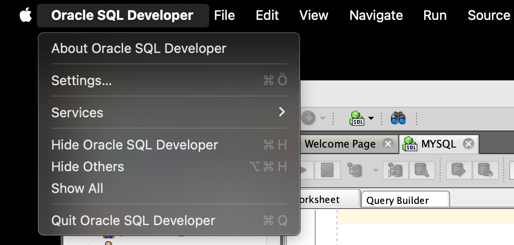
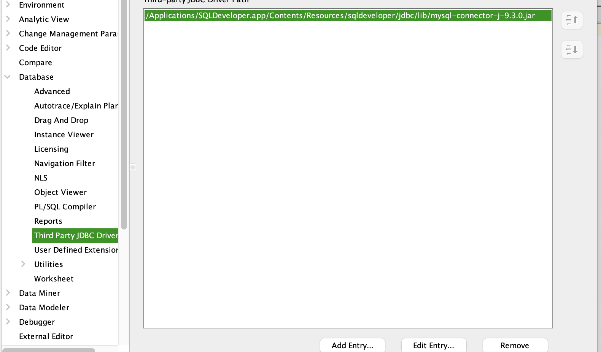

# SQL Developer Installation With MYSQL For MACOS (SOLVED)

## Step 1 :

Install the JDBC driver and SQL developer on your mac.

- [JDBC](https://dev.mysql.com/downloads/connector/j/)
- [SQL Developer](https://www.oracle.com/database/sqldeveloper/technologies/download/)

## Step 2 :

After the download process , unzip the JDBC file and copy the .jar file to */Applications/SQLDeveloper.app/Contents/Resources/sqldeveloper/jdbc/lib* 

to add the MYSQL in SQL Developer.

## Step 3 :

You must to add JDBC file to SQL developer. 

Open the Settings section. After that you’re going to see something like that. 

 

***Database > Third Party JDBC Drivers > Add Entry…***

Then you click the “Add Entry…” select the path that you copied JDBC file.

And ALL DONE ! You can connect mysql on SQL Developer !